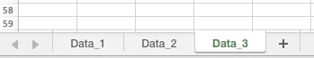

# Export

The export is a very important tool as it lets you put the data into a format you are familiar with, **Excel**. The export step is simple to use and can output any type of data. Each name listed in the function call will be added to a seperate page in the Excel document.

If you need to seperate different data into different excel files just call the Export function again and give it a different name. Note that the export step does not create any operational data, it only saves data to excel in the specified output folder.


## Syntax
The function can be called as follows:

```
EXPORT (File_Name) Data_1 Data_2 Data_3 ...
```


