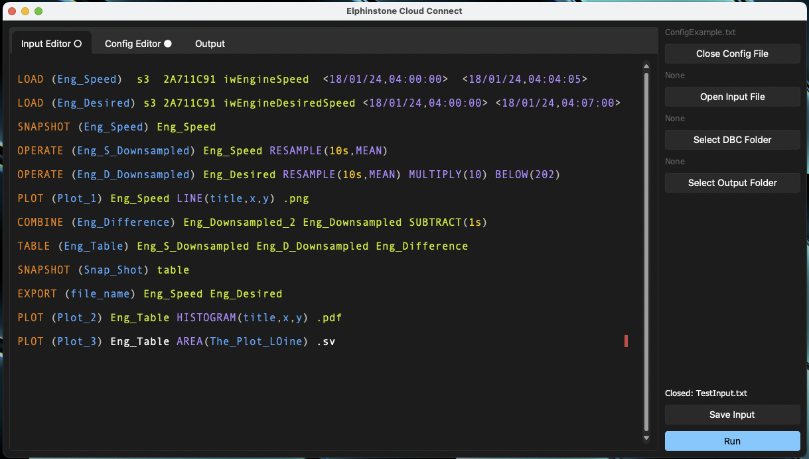

# Overview

Elphinstone Cloud Connect is an internal tool for taking advantage of vehicle data. It is capable of pooling data from multiple sources and of different data-types. The main use case for this software is to analyse historical canbus data to make informed decisions.

## Interface



In its current form cloud connect is a glorified text editor. It comnbines all the operations needed to interact with the command line tool into an easy to use package. It provides assisted text editing, file upload and live progress monitoring.

### Input Editor

The input file, which can be created in the input editor is your connection to the data. It defines the actions/steps that you want to perform on the data to acheive the desired results. Within the gui these input files can be opened edited and saved with linting and syntax highligting.

### Config Editor

The configuration files let you define datasources, these can be from cloud servers such as S3 and Azure or from your local drive. The configuration files also let you set parameters such as local timezone and the timezone of different server connections

### DBC Folder

To retrieve data efficiently cloud connect needs access to information about the CAN protocols you are using. These can be supplied in a folder with the .dbc files you use and then linked using the user interface.

### Output

As the program runs the output terminal will be updated to reflect progress and identify errors which could cause the program to stop. The output of the terminal can be saved at anypoint to a timestamped file. In the case that you are unable to resolve an issue yourself this output file can be used by someone else to idenitfy the issue in your input and config files. 

## Steps

*Steps* are the backbone of **Cloud Control**, they provide the functionality for simple queries, complex procedures and everything inbetween. Each line you write in the input file is considered a step, these can be chained together in any order to produce desired results.

From the navigation bar you can learn the syntax and how to use each of these steps.

### General syntax

Each step will always have these two features, a **TYPE** and a **(Name)**, what follows after is specific to each step type

```  sql
TYPE (Name) ...
```

### Types

**Load**
Loading from data source

**Operate**
Operate on data

**Combine**
Combine single column data

**Table**
Create multicolumn data

**Export**
Export data to excel

**Plot**
Plot data visualisations

**Snapshot**
Quickly check data