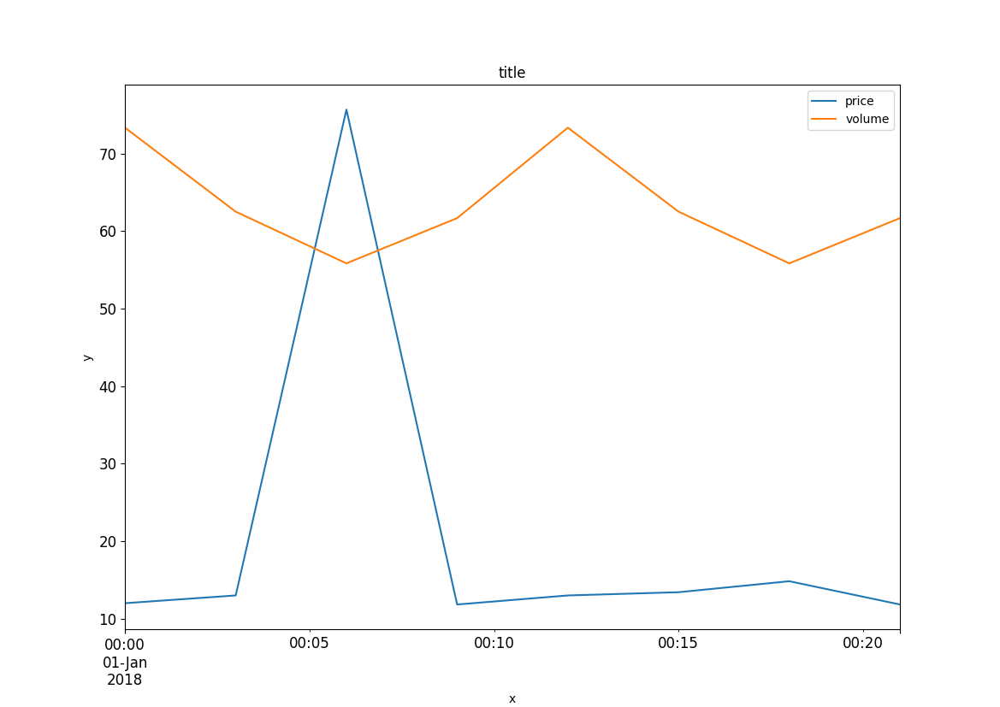
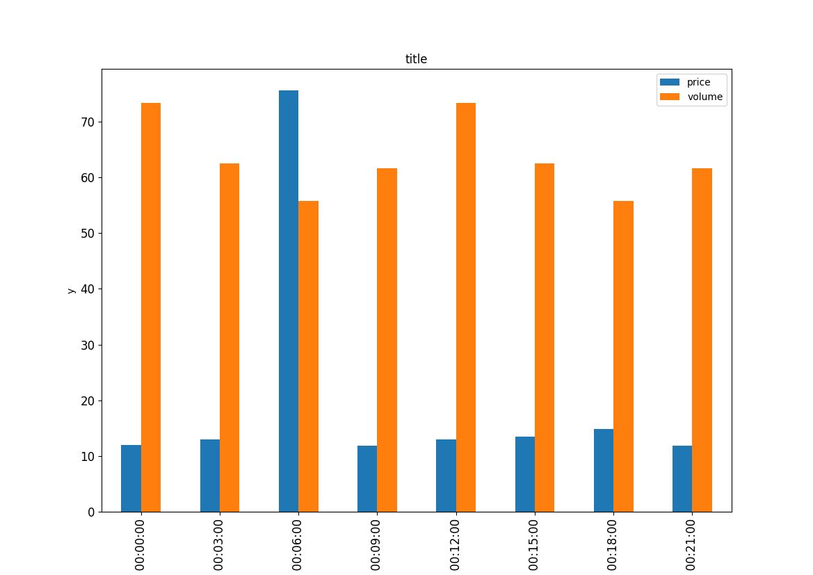
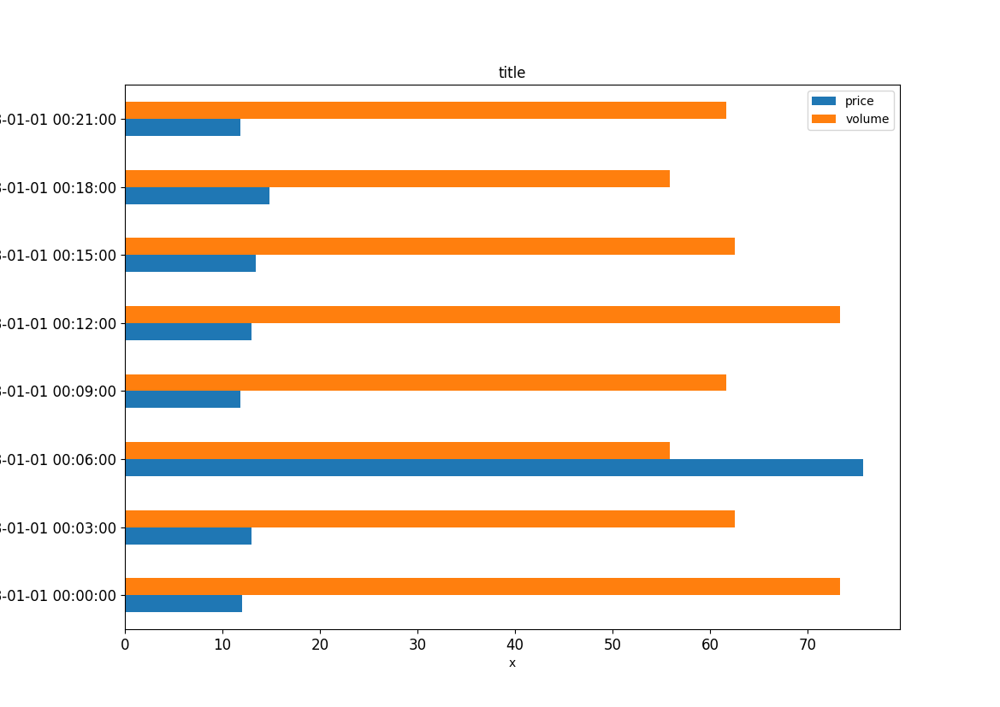
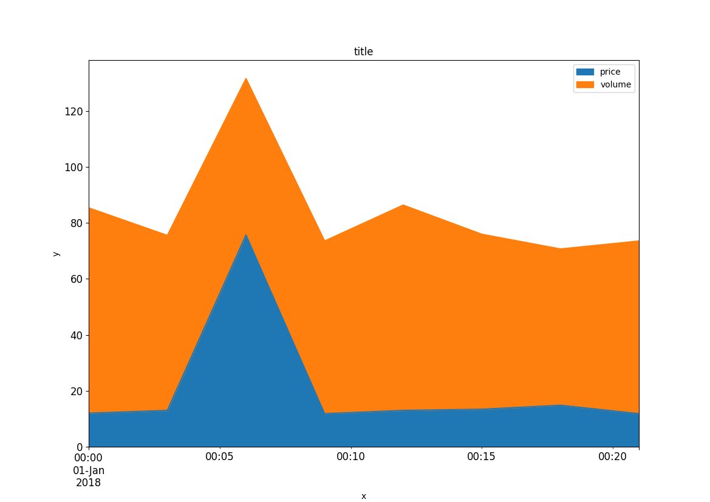

# Plot

Plot is a simple step used to output different graphs. It is useful when you need a quick visualisation and dont want to plot the data yourself in Excel. Most plots will work out of the box with both single and multicoloum data.

There are a few available plot types, all will work with any provided data but some plots are better suited to specific data formats.

The Plots shown below are from a very small dataset, this step is still in testing.

### Line
```
PLOT (Plot_Line) Plot_Data LINE(title,x,y) .png
```



### Bar
```
PLOT (Plot_Bar) Plot_Data BAR(title,x,y) .png
```



### Horizontal Bar
```
PLOT (Plot_HBar) Plot_Data BARH(title,x,y) .png
```



### Area
```
PLOT (Plot_Area) Plot_Data AREA(title,x,y) .png
```



### Histogram

Not currently available

### Scatter

Not currently available
